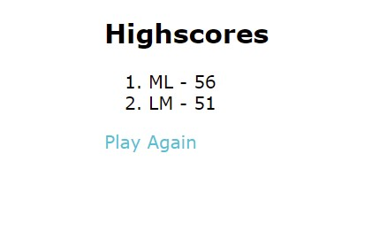

# Javascript Quiz

## Description
This is a Javascript quiz that will test your knowledge as you go through 10 questions to try and achieve a new high score. 

## Quiz
You will be timed during this 10 question quiz and if you answer incorrectly your time will immediately reduce by 10 seconds. Your score at the end will be the time that you have remaining.

As you answer each question, you will also be able to see below the answers whether you answered correctly or incorrectly. Here is an example:

## Highscores
Once you complete the quiz you will have the opportunity to add your initials and score to the list of all-time highscores. You can also view this any time by clicking the link on the top lefthand side of the screen. Here is what the list currently looks like:

## Built With
This website uses the following:
* HTML
* CSS
* Javascript

Visit the live site here: https://meggedde.github.io/CodeQuiz/
